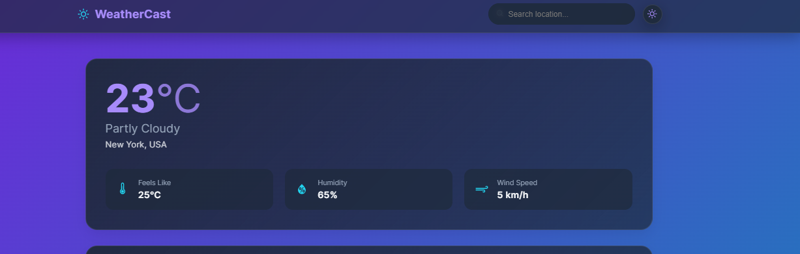

# Modern Weather Forecast App

A beautiful and responsive weather forecast application built with React, TypeScript, and styled-components. Get real-time weather updates with a modern, clean interface that adapts to both light and dark modes.

![Weather App Screenshot]


## Features

- 🌡️ Real-time weather data display
- 🕒 Hourly and daily weather forecasts
- 🌙 Dark/Light theme toggle
- 🎨 Modern UI with glass-morphism effects
- 📱 Fully responsive design
- 🔍 Location search functionality
- 💨 Smooth animations and transitions

## Tech Stack

- **Frontend:**
  - React
  - TypeScript
  - Styled Components
  - Framer Motion
  - React Icons

- **API:**
  - OpenWeather API

## Getting Started

### Prerequisites

- Node.js (v14 or higher)
- npm or yarn
- OpenWeather API key

### Installation

1. Clone the repository:
   ```bash

   git remote add origin https://github.com/shimputa/weather-app.git
   cd weather-forecast-app
   ```

2. Install dependencies:
   ```bash
   npm install
   # or
   yarn install
   ```

3. Create a `.env` file in the root directory and add your OpenWeather API key:
   ```env
   REACT_APP_OPENWEATHER_API_KEY=your_api_key_here
   ```

4. Start the development server:
   ```bash
   npm start
   # or
   yarn start
   ```

5. Open [http://localhost:3000](http://localhost:3000) to view the app in your browser.

## Project Structure

```
src/
├── components/
│   ├── layout/
│   │   ├── Header.tsx
│   │   └── Layout.tsx
│   ├── ui/
│   │   └── ThemeToggle.tsx
│   └── weather/
│       ├── CurrentWeather.tsx
│       ├── DailyForecast.tsx
│       ├── HourlyForecast.tsx
│       └── SearchLocation.tsx
├── styles/
│   ├── GlobalStyles.ts
│   └── theme.ts
└── App.tsx
```

## Features in Detail

### Current Weather
- Displays current temperature
- Weather condition description
- Feels like temperature
- Humidity and wind speed

### Hourly Forecast
- 24-hour weather forecast
- Temperature trends
- Weather condition icons
- Scrollable timeline

### Daily Forecast
- 7-day weather forecast
- High and low temperatures
- Weather condition icons
- Daily weather summary

### Theme Toggle
- Switch between light and dark modes
- Smooth transition effects
- Persistent theme preference

## Contributing

1. Fork the repository
2. Create your feature branch (`git checkout -b feature/AmazingFeature`)
3. Commit your changes (`git commit -m 'Add some AmazingFeature'`)
4. Push to the branch (`git push origin feature/AmazingFeature`)
5. Open a Pull Request

## License

This project is licensed under the MIT License - see the [LICENSE](LICENSE) file for details.

## Acknowledgments

- Weather data provided by [OpenWeather](https://openweathermap.org/)
- Icons from [React Icons](https://react-icons.github.io/react-icons/)
- Animations powered by [Framer Motion](https://www.framer.com/motion/)

## Contact

Your Name - [@yourtwitter](https://twitter.com/yourtwitter)

Project Link: [https://github.com/yourusername/weather-forecast-app](https://github.com/yourusername/weather-forecast-app)

---

Made with ❤️ and React
